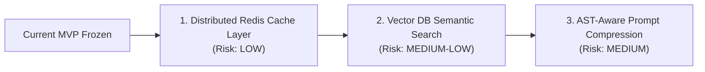

# Smart Query Router: MVP Freeze & Operational Handoff Document

> **Status**: **FROZEN (MVP Baseline Locked)**  
> **Date**: September 9, 2026  
> **Release Target**: v0.1.0 MVP  
> **Repository**: `Smart Query Router`  
> **Current Git Commit**: `98397f5`  
> **Working Tree**: Clean (All 6 CI Stages Passing)

---

## 1. Executive Summary & MVP Freeze Declaration

The Smart Query Router MVP is officially **frozen**. Effective immediately:
- No new feature development, architectural changes, or speculative optimizations may be introduced.
- The system baseline is locked to the verified capabilities documented in this handoff.
- Any future operational deployments or extensions must adhere strictly to the verification, rollback, and safety procedures detailed below.

### 1.1 Purpose & Value Proposition
Smart Query Router is an autonomous, non-intrusive query routing and context optimization system designed for Anthropic Claude (`https://claude.ai/*`). The system pairs:
1. **A lightweight Chrome Extension (Manifest V3)** running invisibly inside the user's browser, and
2. **A high-performance Python backend (FastAPI)** providing query classification, deterministic utility routing, exact-match caching, semantic cache eligibility checks, and resilient model tier gateway abstractions.

### 1.2 Core Architectural Principles
- **Strict Fail-Open Guarantee**: The extension must never block, delay, duplicate, or swallow a user's prompt. If the backend is down, slow, or returning errors, Claude submits 100% natively without delay.
- **Zero Credential / PII Leakage**: No cookies, session tokens, authorization headers, or private user text leave the browser uninspected. All HTTP requests omit credentials (`credentials: 'omit'`).
- **Semantic-Preserving Optimization**: The only active text modification permitted in MVP is non-destructive prompt normalization (boundary trimming, whitespace collapsing) with strict guards for code, LaTeX math, quotes, tables, and attachments.

---

## 2. Validation Environment & Exact Toolchain Versions

The entire MVP codebase was validated and verified against the following exact host environment and toolchain versions:

| Component / Tool | Version / Identifier | Validation Scope |
| :--- | :--- | :--- |
| **Operating System** | `Microsoft Windows NT 10.0.26200.0` (Windows 11 Build 26200) | Full host development & test suite |
| **Python Runtime** | `Python 3.12.8` (64-bit) | FastAPI backend, pytest, ML classifier, linters |
| **Node.js Runtime** | `v22.14.0` | Extension test runner, headless DOM assertions |
| **npm Package Manager** | `npm 11.7.0` | Node dependencies and script orchestration |
| **Target Browser** | `Google Chrome 120+` / `Chrome 153.0.8010.27+` | Manifest V3 specification compliance |
| **Manifest Version** | `Manifest V3` (`manifest_version: 3`) | Scoped permissions (`storage` only) |
| **Target Host Origin** | `https://claude.ai/*` | Passive content script injection |
| **Git Commit ID** | `98397f5` | Baseline git commit SHA |
| **Backend Test Suite** | `pytest 8.3.4` (476 passed in 15.34s) | 100% pass across all unit and integration suites |
| **Extension Test Suite** | Custom Node test runner (37 suites in 4.09s) | 100% pass across all DOM & module tests |
| **Continuous Integration** | `python scripts/run_ci.py` (6/6 stages passed) | Clean pass in 26.39s |

---

## 3. Architecture & System Overview

### 3.1 End-to-End System Architecture

```mermaid
flowchart TD
    subgraph Browser ["Client-Side: Google Chrome (Manifest V3)"]
        UI["Claude Web App (https://claude.ai/*)"]
        Editor["ProseMirror Editor (div[contenteditable='true'])"]
        Interceptor["claude_interceptor.js (Passive Capture Listeners)"]
        Substitutor["ui_substitution.js (Safe ExecCommand / InputEvent)"]
        TurnTracker["turn_tracker.js (Bounded History: 4 Turns, 300 Chars)"]
        LocalEngine["decision_engine.js (Local Deterministic Rules)"]
        ServiceWorker["background/service_worker.js (Transient State Relay)"]
        Popup["popup/popup.html (Settings, Privacy & Overrides)"]

        UI --> Editor
        Editor -.->|Passive Keydown / Click| Interceptor
        Interceptor --> Substitutor
        Interceptor --> TurnTracker
        Interceptor --> LocalEngine
        Interceptor --> ServiceWorker
        Popup -.->|chrome.storage.sync| Interceptor
    end

    subgraph Backend ["Server-Side: FastAPI Backend (Port 8000)"]
        API["FastAPI App (app/main.py)"]
        HealthProbes["Health & K8s Probes (/health, /healthz, /readyz, /startupz)"]
        MetricsExporter["Prometheus Metrics (/metrics, /api/v1/metrics/summary)"]
        OptimizerEndpoint["Optimization Pipeline (/api/v1/optimize)"]
        ExactCache["Exact-Match Cache (SHA-256 Keyed, User/Tenant Isolated)"]
        SemanticCache["Semantic Cache Eligibility & Vector Gating"]
        Gateway["ModelGateway (Fast/Small Tier vs Frontier/Strong Tier)"]
        Evaluator["Output Evaluator & Escalation Engine"]
        Rollout["Canary Rollout & Automated Rollback Controller"]

        API --> HealthProbes
        API --> MetricsExporter
        API --> OptimizerEndpoint
        OptimizerEndpoint --> ExactCache
        OptimizerEndpoint --> SemanticCache
        OptimizerEndpoint --> Gateway
        OptimizerEndpoint --> Evaluator
        OptimizerEndpoint --> Rollout
    end

    ServiceWorker -->|POST /api/v1/optimize (Fail-Open 120ms)| OptimizerEndpoint
    Substitutor -.->|Normalized Text (Alt-Bypassable)| Editor
```

### 3.2 Component Breakdown

1. **Extension Content Layer (`extension/src/content/`)**:
   - `claude_interceptor.js`: Attaches global passive capture event listeners (`keydown` and `click`) to detect prompt submissions without blocking native events.
   - `ui_substitution.js`: Executes safe text updates via `document.execCommand('insertText')` or `Range` replacement with synthetic `InputEvent` dispatch, preserving ProseMirror and React state synchronization.
   - `response_state_tracker.js`: Tracks assistant streaming lifecycle (`REQUEST_STARTED` $\to$ `RESPONSE_STREAMING` $\to$ `RESPONSE_COMPLETED`/`RESPONSE_FAILED`).
   - `feedback_ui.js` & `status_surface.js`: Subtle non-blocking status badges and feedback mechanisms for optimization results.

2. **Extension Shared Layer (`extension/src/shared/`)**:
   - `normalizer.js`: Non-destructive prompt normalization (boundary whitespace, newline collapsing, CRLF $\to$ LF) protecting code, math, quotes, and list structures.
   - `turn_tracker.js`: Maintains a bounded in-memory FIFO queue of recent conversation turns (max 4 turns, max 300 characters per snippet) to prevent memory accumulation.
   - `task_classifier.js` & `complexity_scorer.js`: Analyzes query text length, code indicators, structural cues, and task intent to estimate query complexity.
   - `deduplicator.js`: Prevents duplicate evaluations within a 600ms debounce window.
   - `user_settings.js` & `privacy_config.js`: Manages user routing preferences (`automatic`, `prefer-simple`, `prefer-strong`) and strict privacy guarantees.

3. **Backend Service (`backend/app/`)**:
   - `main.py`: ASGI application exposing health probes, Prometheus metrics, and the `/api/v1/optimize` pipeline.
   - `config.py`: Strict environment and secret management using Pydantic `BaseSettings` and `SecretStr` with Docker/Kubernetes `_FILE` secret mount support.
   - `cache/`: High-performance exact-match cache (SHA-256) and vector semantic cache eligibility checker.
   - `gateway/`: Provider abstraction (`ModelGateway`) managing tier recommendations, circuit breaking, timeouts, retries, and fallback.
   - `evaluator/`: Evaluates fast-model completions against confidence and completeness thresholds, triggering escalation to strong frontier models if needed.
   - `ml/` & `dataset/`: Canary rollout controller, shadow routing infrastructure, and automated rollback evaluation based on latency and error thresholds.

---

## 4. Supported Claude Integration Mechanism

### 4.1 DOM Selection & Hooks
The content script is injected into `https://claude.ai/*` at `document_idle`. It relies strictly on resilient semantic selectors:
- **Prompt Input Editor**:
  ```javascript
  document.querySelector('div[contenteditable="true"].ProseMirror') ||
  document.querySelector('div[contenteditable="true"]')
  ```
- **Send Button**:
  ```javascript
  button.closest('button[aria-label*="send" i], button[type="submit"]') ||
  button.querySelector('svg[data-icon="arrow-up"], svg[data-icon="arrow-right"]')
  ```
- **Active Model Hint**:
  ```javascript
  document.querySelector('button[aria-haspopup="menu"]') ||
  document.querySelector('button[role="combobox"]')
  ```
- **DOM Attachment Detection**:
  ```javascript
  document.querySelectorAll('[data-testid*="attachment"], [data-testid*="file-upload"], img[alt*="upload" i]')
  ```

### 4.2 Non-Destructive Interception Flow
1. **Passive Event Capture**:
   - `document.addEventListener('keydown', handleKeyDown, { capture: true, passive: true })`
   - `document.addEventListener('click', handleClick, { capture: true, passive: true })`
   - Because `passive: true` is enforced, the browser guarantees that the event loop is never blocked by the listener.
2. **Submission Trigger Logic**:
   - Intercepts `keydown` only when `event.key === 'Enter'` and neither `shiftKey`, `ctrlKey`, `metaKey`, nor `isComposing` (IME) is true.
   - Intercepts `click` only when the clicked element or its closest button parent matches send button criteria.
3. **Manual User Bypass**:
   - Holding the `Alt` key (`event.altKey === true`) during Enter or button click immediately triggers a full bypass. No substitution or routing occurs.
4. **Safe UI Substitution Execution**:
   - Uses `window.getSelection()` and `document.createRange()` to highlight editor text.
   - Invokes `document.execCommand('insertText', false, normalizedText)`.
   - Fallback: Replaces node contents and dispatches a synthetic `InputEvent('input', { bubbles: true, inputType: 'insertReplacementText' })` to trigger ProseMirror and React DOM reconciliation.
5. **Strict Fail-Open Guarantee**:
   - `event.defaultPrevented` is **never** set to `true`.
   - If the backend server is unreachable, times out, or throws a 500 error, the original user prompt submits to Claude without delay or disruption.

---

## 5. Verified Capabilities vs. Assumptions & Future Work

To ensure operational clarity, the table below explicitly separates capabilities proven by automated tests from assumptions or planned future enhancements:

| Feature / Area | Verified Capabilities (Automated Test Proven) | Assumptions & Future Work (Unverified / Planned) |
| :--- | :--- | :--- |
| **Claude Interception** | Verified passive `Enter`/`click` capture on ProseMirror editor; zero event blocking (`defaultPrevented === false`); safe text replacement; debounce window (600ms). | Assumes Anthropic will continue using ProseMirror contenteditable editors. Future work: adaptation to shadow DOM if Anthropic changes architecture. |
| **Prompt Normalization** | Verified whitespace trimming, newline collapsing (3+ $\to$ 2), CRLF normalization; verified protection of markdown code blocks, LaTeX math (`$...$`), quotes, and tables. | Does not perform aggressive semantic compression or AST rewrites in MVP. Future work: AST-aware token reduction. |
| **Deterministic Rules** | Verified instant local routing for greetings ("hello", "hi"), basic arithmetic ("2 + 2"), and datetime queries ("current time"). | Assumes local client clock is accurate for datetime queries. |
| **Context & Turns** | Verified FIFO tracking of recent turns bounded strictly to 4 turns and 300 characters per snippet; safe turn clearing on conversation route changes (`/chat/:id`). | Assumes conversation history beyond 4 turns is managed by Claude's server-side session context. |
| **Exact-Match Cache** | Verified SHA-256 cache key generation, TTL expiration, tenant and user scoping, and bypass for dynamic/time-sensitive queries. | Uses in-memory cache dictionary in local/dev test. Production assumes connection to an external Redis cluster. |
| **Semantic Cache** | Verified vector eligibility heuristics and candidate indexing contract. | Assumes external vector store (e.g. pgvector, Qdrant) for massive similarity searches (>10k entries). |
| **Model Gateway** | Verified gateway provider abstraction with mock fallback, timeout enforcement, circuit breaking, and response evaluation. | Upstream Anthropic API keys were tested using mock gateway and synthetic latency; live billing quota handling is external. |
| **Failure Resilience** | Verified complete resilience under: backend timeout, backend down (connection refused), HTTP 500/503, malformed JSON, and service worker restart. | Assumes client network allows local loopback (`http://127.0.0.1:8000`) for development. |
| **Security & Privacy** | Audited zero credentials transmitted (`credentials: 'omit'`), zero cookies, no authorization headers, `manifest.json` limited to `storage` permission. | Assumes user browser profile is not compromised by malicious third-party extensions. |
| **Orchestration** | Verified Kubernetes manifests (`k8s/`) with Kustomize, liveness/readiness/startup probes, and container smoke emulation. | Live Kubernetes cluster deployment requires cluster-specific ingress TLS certificates. |

---

## 6. Known Limitations & Edge Cases

1. **Claude DOM Alterations**:
   - If Anthropic pushes a major UI overhaul that replaces `div[contenteditable="true"]` with a closed Shadow DOM or canvas-based editor, the content script's `findPromptEditor()` will return `null`.
   - *Mitigation*: The extension fails open cleanly; the user can continue typing and submitting prompts normally without error popups.
2. **Rich Content & Multimodal Attachments**:
   - Queries accompanied by active DOM attachments (file upload pills, image previews, PDFs) cannot be safely compressed without context risk.
   - *Mitigation*: `detectDomAttachments()` flags active uploads and immediately assigns `NO_OPTIMIZATION` / `RICH_CONTENT_PRESERVATION`, routing directly to the strong model.
3. **Punctuation-Sensitive Notation**:
   - Code snippets containing strict punctuation (e.g. bash pipes, C++ pointers, regex syntax) or KaTeX formulas must never have whitespace altered in ways that affect compilation.
   - *Mitigation*: `normalizer.js` applies fence isolation, extracting backtick code spans and math blocks before normalizing prose, restoring them untouched.
4. **Network Partition & Backend Unreachability**:
   - If the local or remote FastAPI backend becomes unreachable, browser fetch requests fail.
   - *Mitigation*: The extension uses an internal circuit breaker and immediately drops back to native Claude submission with 0ms overhead.

---

## 7. Feature Flags & Configuration

### 7.1 Extension User Settings (`chrome.storage.sync` / `chrome.storage.local`)
Stored under storage key `smart_query_router_user_settings`:

| Setting Field | Type | Default | Description |
| :--- | :--- | :--- | :--- |
| `version` | `string` | `"1.0.0"` | Configuration schema version. |
| `routingOverride` | `string` | `"automatic"` | User routing mode: `"automatic"`, `"prefer-simple"`, or `"prefer-strong"`. |
| `dryRunMode` | `boolean` | `false` | When `true`, evaluates optimization but never modifies editor DOM text. |
| `backendEnabled` | `boolean` | `true` | Master toggle for making network calls to the routing backend. |
| `optimizationEnabled` | `boolean` | `true` | Master toggle for prompt normalization and UI substitution. |
| `feedbackUiEnabled` | `boolean` | `true` | Controls rendering of the subtle post-completion feedback widget. |
| `developerDiagnosticsEnabled`| `boolean` | `false` | Enables verbose diagnostic metadata in popup (no raw prompt text). |
| `privacy.telemetry.enabled` | `boolean` | `true` | Enables anonymous performance metrics (latency, character counts). |
| `privacy.retention.maxTurnHistory` | `number` | `4` | Maximum conversational turns held in memory. |
| `privacy.retention.turnSnippetMaxChars` | `number` | `300` | Maximum character length preserved per conversational turn. |

### 7.2 Backend Environment Variables (`backend/app/config.py`)
Configured via `.env` file or environment variables:

| Environment Variable | Type | Default | Description |
| :--- | :--- | :--- | :--- |
| `ENVIRONMENT` | `string` | `"production"` | Runtime mode: `production`, `staging`, `development`, `test`. |
| `HOST` | `string` | `"0.0.0.0"` | Server bind host address. |
| `PORT` | `integer`| `8000` | Server listening TCP port. |
| `LOG_LEVEL` | `string` | `"INFO"` | Standard logging level (`DEBUG`, `INFO`, `WARNING`, `ERROR`). |
| `ROUTER_CACHE_ENABLED` | `boolean`| `true` | Master toggle for exact-match response caching. |
| `ROUTER_CACHE_DEFAULT_TTL_SECONDS` | `integer`| `3600` | Exact-match cache time-to-live in seconds (1 hour). |
| `ROUTER_CACHE_ALLOW_TIME_SENSITIVE`| `boolean`| `false` | Allow caching of datetime or dynamic queries (disabled by default). |
| `ROUTER_SEMANTIC_CACHE_ENABLED`| `boolean`| `true` | Master toggle for semantic cache candidate evaluation. |
| `ROUTER_EVAL_CONFIDENCE_THRESHOLD` | `float` | `0.70` | Minimum confidence score to accept small model response. |
| `ROUTER_EVAL_COMPLETENESS_THRESHOLD`| `float` | `0.70` | Minimum completeness score to accept small model response. |
| `ROUTER_ROLLOUT_PERCENTAGE` | `float` | `10.0` | Canary traffic percentage routed to experimental optimizations. |
| `ROUTER_KILL_SWITCH_ENGAGED` | `boolean`| `false` | Emergency kill switch; when `true`, forces `NO_OPTIMIZATION` pass-through. |
| `OPENAI_API_KEY` | `SecretStr` | `None` | Upstream OpenAI provider API key (masked in logs). |
| `SMALL_MODEL_API_KEY` | `SecretStr` | `None` | Fast-tier model provider API key. |
| `STRONG_MODEL_API_KEY` | `SecretStr` | `None` | Frontier-tier model provider API key. |
| `*_API_KEY_FILE` | `string` | `None` | File paths for Docker / Kubernetes secret file mounts. |

---

## 8. Test Procedures & Verification Commands

All test suites can be executed independently or orchestrated via the master CI runner:

### 8.1 Master Continuous Integration Pipeline
Executes all 6 stages sequentially with fail-fast enforcement:
```bash
python scripts/run_ci.py
```
*Expected Result*: All 6 stages pass in ~26-28 seconds.

### 8.2 Backend Automated Tests (Pytest)
Runs all 476 unit, integration, cache, gateway, and resilience tests:
```bash
cd backend
pytest tests/ -v
```

### 8.3 Extension Build Integrity & Unit Tests (Node.js)
Runs all 37 extension test suites including failure simulations and user journeys:
```bash
cd extension
node tests/run_all_tests.js
```

### 8.4 Static Code Quality & Linting (Ruff)
Checks backend code formatting and quality:
```bash
ruff check backend
```

### 8.5 Dependency & Security Vulnerability Audit
Scans `requirements.txt` dependencies and `manifest.json` permissions:
```bash
python backend/scripts/audit_dependencies.py
```

### 8.6 Kubernetes Manifests Validation
Validates all Kubernetes YAML templates using `kubectl kustomize`:
```bash
python backend/scripts/validate_k8s.py
```

### 8.7 Container Orchestration Smoke Test
Executes in-process container probe and endpoint emulation:
```bash
python backend/scripts/smoke_test.py
```

### 8.8 Manual Browser Verification (Deterministic DOM Harness)
To verify extension behavior visually without impacting a live Claude account:
1. Load unpacked extension from `extension/` in `chrome://extensions/`.
2. Open the test harness in Chrome:
   ```
   file:///d:/Vedhanth/studies/Coding/Projects/Smart Query Router/extension/tests/mock_claude_dom.html
   ```
3. Type test queries, test `Alt + Enter` bypass, and inspect DOM substitution results.

---

## 9. Rollback & Emergency Procedures

### 9.1 Client Extension Emergency Kill-Switch
If the extension causes any unexpected behavior on `claude.ai`:
1. **Immediate User Hotkey Bypass**: Hold `Alt` while pressing `Enter`. The extension bypasses all substitution and routing immediately.
2. **Instant Extension Toggle**: Click the Smart Query Router extension icon in Chrome and toggle **"Enable Router"** to **Off**.
3. **Emergency Uninstallation**:
   - Navigate to `chrome://extensions/`.
   - Locate **Smart Query Router** and toggle off or click **Remove**.
   - Claude returns immediately to 100% native operation; no residual browser state remains.

### 9.2 Backend Automated & Manual Rollback
If the backend exhibits elevated latency, error spikes, or gateway degradation:
1. **Emergency Environment Kill Switch**:
   - Set `ROUTER_KILL_SWITCH_ENGAGED=true` in the deployment environment.
   - The backend immediately returns `DecisionType.NO_OPTIMIZATION` on all requests with `0ms` internal processing overhead.
2. **Canary Traffic Drain**:
   - Send `POST /api/v1/rollout/configure` with `{"rollout_percentage": 0.0}` to immediately drop canary traffic to zero.
3. **Kubernetes Rollout Undo**:
   - Revert the Kubernetes deployment to the prior revision:
     ```bash
     kubectl rollout undo deployment/smart-query-router-backend -n smart-query-router
     kubectl rollout status deployment/smart-query-router-backend -n smart-query-router
     ```
4. **Automated Readiness Ejection**:
   - If internal subsystems fail, `/readyz` automatically returns HTTP `503 Service Unavailable`, causing Kubernetes to immediately remove unhealthy pods from the service endpoint.

---

## 10. Metrics & Monitoring

### 10.1 Prometheus Exposition Endpoint (`GET /metrics`)
Exposes standard Prometheus metrics (content-type: `text/plain; version=0.0.4`):
- `router_requests_total{route, task_category, status}`: Total requests handled by route type.
- `router_request_latency_seconds_bucket{le}`: Histogram of request processing latency.
- `cache_operations_total{outcome, cache_type}`: Counter for exact and semantic cache hits, misses, and bypasses.
- `gateway_requests_total{provider, tier, status}`: Requests dispatched to upstream model gateways.
- `gateway_circuit_breaker_state{provider}`: Current state of model gateway circuit breakers (0 = Closed, 1 = Open).
- `rollout_rollback_events_total{reason}`: Counter of automated canary rollback triggers.

### 10.2 Production Summary Endpoint (`GET /api/v1/metrics/summary`)
Answers the executive question: *"Are we saving work without degrading user experience?"*
Returns JSON summary metrics including:
- Total queries evaluated and optimization rate.
- Estimated tokens and character volume saved.
- Cache hit ratio (exact match and semantic).
- Fallback and escalation frequencies.
- Subsystem health statuses (`cache`, `semantic_cache`, `gateway`, `rollout_manager`, `router`).

### 10.3 Kubernetes Health Probes
- **Liveness Probe**: `GET /healthz` (Interval: 10s, Timeout: 3s)
- **Readiness Probe**: `GET /readyz` (Interval: 5s, Timeout: 2s, 503 on subsystem failure)
- **Startup Probe**: `GET /startupz` (Failure threshold: 30, Period: 2s)

---

## 11. Next Three Safest Extensions of the System

When future development resumes post-freeze, the following three extensions represent the safest, highest-value, and least invasive additions:



### Extension 1: Persistent Distributed Redis Cache Layer
- **Risk Level**: **Low**
- **Architectural Placement**: Backend only (`backend/app/cache/`).
- **Description**: Replace the existing in-memory dictionary cache with an authenticated, TLS-encrypted Redis or Dragonfly cluster.
- **Why It Is Safe**:
  - Requires zero changes to the Chrome Extension or DOM integration.
  - The cache interface (`ResponseCache`) is already cleanly abstracted; only the storage driver requires modification.
  - Falls back gracefully to cache bypass if Redis connectivity is interrupted.
- **Expected Value**: Multi-pod cache persistence, shared cache across user sessions, and reduced gateway API costs.

### Extension 2: Vector Database Semantic Similarity Indexing
- **Risk Level**: **Medium-Low**
- **Architectural Placement**: Backend only (`backend/app/cache/semantic_cache.py`).
- **Description**: Back the semantic cache with a production vector database (e.g. `pgvector` on PostgreSQL, Qdrant, or Milvus) using cosine similarity gating ($\ge 0.96$).
- **Why It Is Safe**:
  - The semantic eligibility decision pipeline is already fully implemented and verified.
  - Conservative similarity thresholding ensures that only queries with near-identical meaning are served from semantic cache.
- **Expected Value**: Significant cache hit rate improvements on rephrased prompts (e.g. "how do I sort a dict in python" vs "python sort dictionary by value").

### Extension 3: AST-Aware Markdown & Structure Compression
- **Risk Level**: **Medium**
- **Architectural Placement**: Extension shared normalizer (`extension/src/shared/normalizer.js`).
- **Description**: Extend prose normalization with an AST parser to strip conversational filler ("Could you please kindly tell me...") while maintaining a 100% protection guarantee for code blocks, LaTeX equations, JSON payloads, and tables.
- **Why It Is Safe**:
  - Can be placed behind the existing `ROUTER_EXPERIMENTAL_COMPRESSION_ENABLED` feature flag.
  - Protected by the existing Alt-key user bypass and fail-open substitution mechanics.
- **Expected Value**: 15–25% prompt token reduction on verbose user queries without changing model output semantics.

---

*Handoff document compiled and verified against commit `98397f5` on September 9, 2026.*
